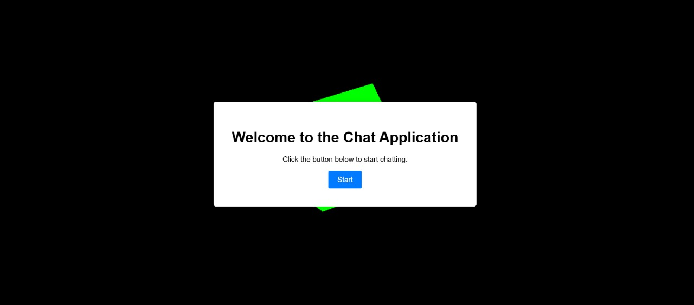
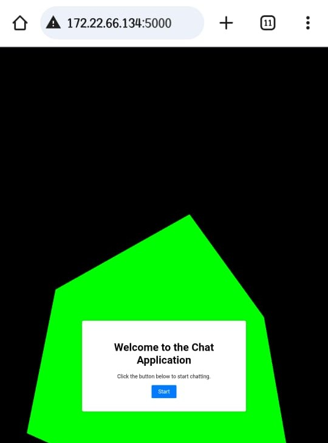
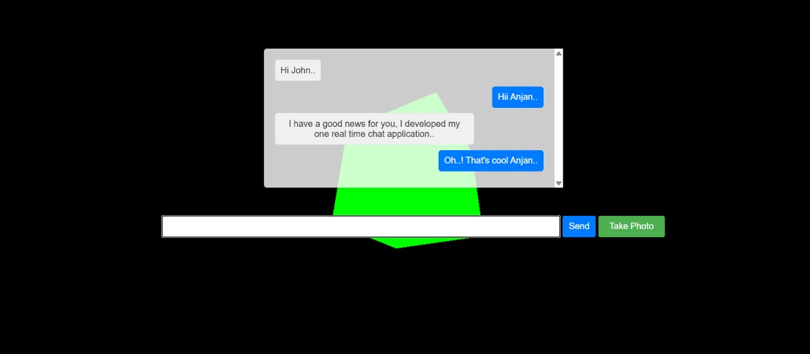
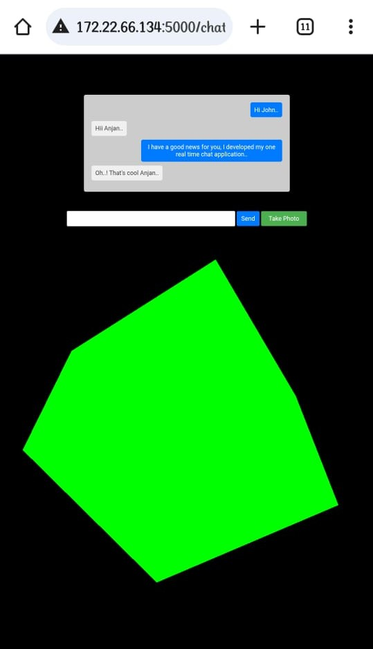

# 🧠 Real-Time Chat Application with 3D Background

*This project is a Flask-based real-time chat app powered by Socket.IO. It supports live text messaging overlaid on a 3D animated background using Three.js.*

## 🚀 Features

- Real-time text chat

- Broadcast messages to all connected users

- Animated 3D cube background using Three.js

- Mobile-responsive UI with styled chat interface

- Flask backend with Socket.IO integration

## Device-1

  

## Device-2

  

## 📁 Project Structure

project/

├── app.py                 # Flask app with Socket.IO

├── templates/

│   ├── index.html         # Chat page

│   └── start.html         # Welcome/start page

└── static/                # (Optional for CSS/JS if externalized)

## 🛠️ Requirements

+ Python 3.7+

+ Flask

+ Flask-SocketIO

## Install dependencies

pip install flask flask-socketio

## ▶️ Run the App

python app.py

## Sample Images

  

  

## 🧪 Future Improvements

- Add support for usernames or avatars

- Create chat rooms or team-based chats

- Store messages in a database

## 📝 License
- This project is free to use under the MIT License.
